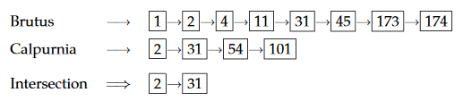
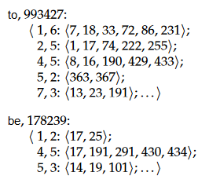

## Task 1.1

`compile_all.bat && run_tokenizer.bat`

`diff tokenized_result.txt token_test_tokenized_ok.txt`

## Task 1.3

Modified Files:

- HashedIndex - insert, getPostings
- PostingsList - insert
- PostingsEntry - constructor
- Searcher - search, intersect

5-word queries:

- `dogs outside in the park` - 70 matches
- `yesterday today tomorrow this year` - 41 matches

Indexing takes ~50 seconds, searching takes 0.001 seconds.

Intersect is achieved by two pointers traversing each list, if a match is found then it is part of the intersection, increase the pointer pointing to the lower docID until either end is reached.

## Task 1.4

Modified Files:

- PostingsEntry - occurrences list, addOccurrence
- HashedIndex - add position of token in insert
- Searcher - add PHRASE_QUERY case and positionalIntersect

Own query:

- `nbsp Im a fulltime student` - from MyaBrn.f

Indexing takes ~50 seconds, searching takes 0.002 seconds.

Same way as the normal intersect to find the two documents which contain both of the words. Then, iterate through all the positions of the first word and try to find if the other word appears 2 tokens later. If it does, they are "positionally related" and is added as part of the intersection.

Example above, "to be or not to be".

Q: Why are fewer documents generally returned in phrase query mode than in intersection query mode?

A: Because it is a stricter constraint. The "normal" intersection query mode only returns documents which contain both (or all) of the words. The phrase query mode also satisfies this, but also requires those words to appear in the same order as in the query; as a phrase, which reduces the amount of satisfactory documents.

## Task 1.5

## Task 1.6

## Task 1.7
