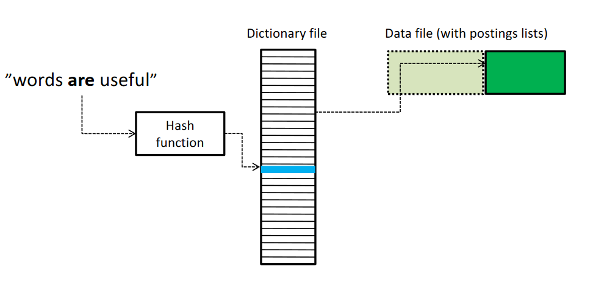

## Task 1.1

`compile_all.bat && run_tokenizer.bat`

`diff tokenized_result.txt token_test_tokenized_ok.txt`

## Task 1.3

Modified Files:

- HashedIndex - insert, getPostings
- PostingsList - insert
- PostingsEntry - constructor
- Searcher - search, intersect

5-word queries:

- `dogs outside in the park` - 70 matches
- `yesterday today tomorrow this year` - 41 matches

Indexing takes ~50 seconds, searching takes 0.001 seconds.


Intersect is achieved by two pointers traversing each list, if a match is found then it is part of the intersection, increase the pointer pointing to the lower docID until either end is reached.

## Task 1.4

Modified Files:

- PostingsEntry - occurrences list, addOccurrence
- HashedIndex - add position of token in insert
- Searcher - add PHRASE_QUERY case and positionalIntersect

Own query:

- `nbsp Im a fulltime student` - from MyaBrn.f

Indexing takes ~50 seconds, searching takes 0.002 seconds.


Same way as the normal intersect to find the two documents which contain both of the words. Then, iterate through all the positions of the first word and try to find if the other word appears 2 tokens later. If it does, they are "positionally related" and is added as part of the intersection.

Example above, "to be or not to be".

Q: Why are fewer documents generally returned in phrase query mode than in intersection query mode?

A: Because it is a stricter constraint. The "normal" intersection query mode only returns documents which contain both (or all) of the words. The phrase query mode also satisfies this, but also requires those words to appear in the same order as in the query; as a phrase, which reduces the amount of satisfactory documents.

## Task 1.5

Query: `graduate program mathematics`

```
(0) Irrelevant document. The document does not contain any information about the
topic.

(1) Marginally relevant document. The document only points to the topic. It does not
contain more or other information than the topic description.

(2) Fairly relevant document. The document contains more information than the
topic description, but the presentation is not exhaustive.

(3) Highly relevant document. The document discusses the themes of the topic
exhaustively.


QUERY_ID DOC_ID RELEVANCE_SCORE
1 Biological_Systems_Engineering.f 0 -- talks about biological systems engineering, only mentions mathematics once as a course
1 Candidate_Statements.f 0 -- only mentions a mathematics major as candidate
1 Computer_Science.f 0 -- only mentions a mathematics course
1 document_translated.f 0 -- only mentions a mathematics professor/department
1 ECE_Course_Reviews.f 0 -- only mentions a mathematics course
1 Economics.f 0 -- talks about economics, maths is just a prerequisite
1 Elaine_Kasimatis.f 1 -- talks about a mathematics graduate
1 Evelyn_Silvia.f 1 -- same as above
1 Events_Calendars.f 0 -- just a bunch of links, of which none are blatantly tied to the query
1 Fiber_and_Polymer_Science.f 0 -- only mentions mathematics courses
1 Hydrology.f 0 -- only mentions mathematics courses
1 Mathematics.f 3 -- highly relevant, mentions the graduate programs etc
1 MattHh.f 1 -- talks about a mathematics graduate
1 Private_Tutoring.f 0 -- about private tutors, although mentions math graduates
1 Quantitative_Biology_and_Bioinformatics.f 0 -- about biology etc, only mentions a maths course
1 Statistics.f 2 -- not as specific as a full-on maths graduate program, but still mentions information relevant to those interested; "If you are interested in going to grad school in biostatistics, applied statistics or mathematics, or biology, this research program is for you."
1 Student_Organizations.f 0 -- could be a 1, since it mentions a club relevant to maths students
1 UCD_Honors_and_Prizes.f 0 -- could be a 1, since it mentions an "honorary society" for maths student
1 UC_Davis_English_Department.f 1 -- includes a mathematics major
1 University_Departments.f 1 -- mentions the mathematics department
1 What_I_Wish_I_Knew...Before_Coming_to_UC_Davis_Entomology.f 2 -- contact information and deadline for applying to the mathematics department
1 Wildlife%2C_Fish%2C_and_Conservation_Biology.f 0 -- mentions it is indirectly involved with mathematics graduate programs, but still not relevant enough
```

**Difficult cases:**

```
1 Elaine_Kasimatis.f 1 -- talks about a mathematics graduate, is that considered relevant?
1 MattHh.f 1 -- talks about a mathematics graduate, is that considered relevant?
1 Wildlife%2C_Fish%2C_and_Conservation_Biology.f 0 -- mentions it is indirectly involved with mathematics graduate programs, but still not relevant enough
```

**Precision and Recall**

Number of returned documents with relevance > 0: 8

Precision = returned and relevant / returned = 8 / 22 = 0.36

Recall = returned and relevant / relevant (assumed) = 8 / 100 = 0.08

## Task 1.6

Query: `graduate program mathematics UC davis`

Result (18):

```
Candidate_Statements.f 0
Computer_Science.f 0
ECE_Course_Reviews.f 0
Economics.f 0
Elaine_Kasimatis.f 1
Evelyn_Silvia.f 1
Events_Calendars.f 0
Hydrology.f 0
Mathematics.f 3
MattHh.f 1
Private_Tutoring.f 0
Statistics.f 2
Student_Organizations.f 0
UCD_Honors_and_Prizes.f 0
UC_Davis_English_Department.f 1
University_Departments.f 1
What_I_Wish_I_Knew...Before_Coming_to_UC_Davis_Entomology.f 2
Wildlife%2C_Fish%2C_and_Conservation_Biology.f 0
```

Number of returned documents with relevance > 0: 8

Precision = returned and relevant / returned = 8 / 18 = 0.44

Recall = returned and relevant / relevant (assumed) = 8 / 100 = 0.08

New query: `graduate program mathematics UC davis department`

Result (14):

```
Candidate_Statements.f 0
Computer_Science.f 0
ECE_Course_Reviews.f 0
Evelyn_Silvia.f 1
Events_Calendars.f 0
Hydrology.f 0
Mathematics.f 3
Private_Tutoring.f 0
Statistics.f 2
UCD_Honors_and_Prizes.f 0
UC_Davis_English_Department.f 1
University_Departments.f 1
What_I_Wish_I_Knew...Before_Coming_to_UC_Davis_Entomology.f 2
Wildlife%2C_Fish%2C_and_Conservation_Biology.f 0
```

Number of returned documents with relevance > 0: 6

Precision = returned and relevant / returned = 6 / 14 = 0.43

Recall = returned and relevant / relevant (assumed) = 6 / 100 = 0.06

**Why you think that the final query gave better precision and/or recall than the earlier variants.** They become more specific to the purpose, which weeds out unrelated documents that do not contain those specific terms.

**Why can we not simply set the query to be the entire information need description?** It would for example result in just 1 matching document, because all terms from the query would have to be present, which is an unreasonable requirement since we do not need it to strictly contain the word "info", etc..

## Task 1.7

```
compile_all.bat && run_search_engine.bat
run_persistent.bat
```

Modified files:

- PersistentHashedIndex - all
- PostingsList - toString and constructor from string
- PostingsEntry - toString and constructor from string



When saving the hashmap to disk, go through the keys and store each PostingsList in the data file, placing it after all previously stored lists. When a PostingsList is stored, hash the key (token) and place the pointer to the PostingsList in a dictionary file at the hash position. During lookup, hash the token, go to that position in the dictionary, look at the position in the data file and see if it is the correct PostingsList. If yes, parse and return it. If no, go to the next hash slot until correct one is found (to handle collisions) or until that slot is empty (no such token exists).

Hash function only needs to spread out the words and reduce collisions. Collisions will still occur. Estimate the size of the alphabet (all relevant characters in a term) to be 50 (alphabet + numbers + misc) and let each position represent a power of 50. Take modulo of the tablesize to keep it within bounds.

## Task 1.8
