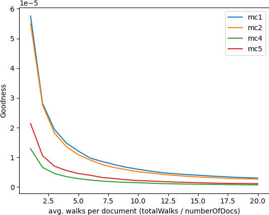

## Task 2.2

- Added the (rudimentary) union method and cosineRank in Searcher, and added the ability to get a PostingsEntry by the docID in PostingsList.

## Task 2.3

**What is the term frequency of the words ‘davis’ and ‘leadership’?**

|     | **davis** ALILP.f | **leadership** ALILP.f | **davis** Davis_Funeral_Chapel.f | **leadership** Davis_Funeral_Chapel.f |
| --- | ----------------- | ---------------------- | -------------------------------- | ------------------------------------- |
| tf  | 0                 | 1                      | 1                                | 0                                     |

**Now use your search engine (how?) to compute the idf of all terms present in both files (round to 4 decimal places). What are the lengths of these documents in the tf-space and in the tf×idf space (rounded to 4 decimal places)?**

Need total number of documents, which is N = 17478.

We then calculate the idf for each distinct term in our document selection (by using idf = ln(N/df)):

|            | df    | idf    |
| ---------- | ----- | ------ |
| davis      | 10312 | 0.5276 |
| leadership | 376   | 3.8391 |
| redirect   | 1907  | 2.2154 |
| asian      | 378   | 3.8338 |
| pacific    | 236   | 4.3049 |
| islander   | 30    | 6.3675 |
| program    | 1377  | 2.5410 |
| wiscombes  | 7     | 7.8228 |
| funeral    | 28    | 6.4365 |
| chapel     | 26    | 6.5106 |

Which gives

|                     | **davis leadership** | ALILP.f | Davis_Funeral_Chapel.f |
| ------------------- | -------------------- | ------- | ---------------------- |
| Euclidean, tf       | 1.4142               | 2.4495  | 2.2361                 |
| Manhattan, tf       | 2                    | 6       | 5                      |
| Euclidean, tf x idf | 3.8752               | 9.9939  | 12.2556                |
| Manhattan, tf x idf | 4.3667               | 23.1017 | 23.5129                |

Calculated using:

```
Euclidean tf x idf:
sqrt((1*ln(17478/10312))^2 + (1*ln(17478/376))^2) = 3.8752
sqrt((1*ln(17478/1907))^2 + (1*ln(17478/378))^2 + (1*ln(17478/236))^2 + (1*ln(17478/30))^2 + (1*ln(17478/376))^2 + (1*ln(17478/1377))^2) = 9.9939
sqrt((1*ln(17478/1907))^2 + (1*ln(17478/7))^2 + (1*ln(17478/10312))^2 + (1*ln(17478/28))^2 + (1*ln(17478/26))^2) = 12.2556

Manhattan tf x idf:
1*ln(17478/10312) + 1*ln(17478/376) = 4.3667
1*ln(17478/1907) + 1*ln(17478/378) + 1*ln(17478/236) + 1*ln(17478/30) + 1*ln(17478/376) + 1*ln(17478/1377) = 23.1017
1*ln(17478/1907) + 1*ln(17478/7) + 1*ln(17478/10312) + 1*ln(17478/28) + 1*ln(17478/26) = 23.5129
```

(Note: the idf in the query is ln(2/1) for both terms)

**What is the cosine similarity between the query and the two documents (in the specified spaces using the specified length normalization, rounded to 4 decimal places)? Don’t forget to use idf for the query terms in the two last rows.**

```
ALILP.f:

tf:
Euclidean: (1*1) / (sqrt(2) * sqrt(6)) = 0.2887
Manhattan: (1*1) / (2 * 6) = 0.0833

tf x idf:
Euclidean: (1*ln(17478/10312) * 1*ln(17478/10312)) / (sqrt((1*ln(17478/10312))^2 + (1*ln(17478/376))^2) * sqrt((1*ln(17478/1907))^2 + (1*ln(17478/378))^2 + (1*ln(17478/236))^2 + (1*ln(17478/30))^2 + (1*ln(17478/376))^2 + (1*ln(17478/1377))^2)) = 0.0072
Manhattan: (1*ln(17478/10312) * 1*ln(17478/10312)) / ((1*ln(17478/10312) + 1*ln(17478/376)) * (1*ln(17478/1907) + 1*ln(17478/378) + 1*ln(17478/236) + 1*ln(17478/30) + 1*ln(17478/376) + 1*ln(17478/1377))) = 0.0028


Davis_Funeral_Chapel.f:

tf:
Euclidean: (1*1) / (sqrt(2) * sqrt(5)) = 0.3162
Manhattan: (1*1) / (2* 5) = 0.1000

tf x idf:
Euclidean: (1*ln(17478/10312) * 1*ln(17478/10312)) / ((sqrt((1*ln(17478/10312))^2 + (1*ln(17478/376))^2)) * (sqrt((1*ln(17478/1907))^2 + (1*ln(17478/7))^2 + (1*ln(17478/10312))^2 + (1*ln(17478/28))^2 + (1*ln(17478/26))^2))) = 0.0059
Manhattan: (1*ln(17478/10312) * 1*ln(17478/10312)) / ((1*ln(17478/10312) + 1*ln(17478/376)) * (1*ln(17478/1907) + 1*ln(17478/7) + 1*ln(17478/10312) + 1*ln(17478/28) + 1*ln(17478/26))) = 0.0027
```

|                            | ALILP.f | Davis_Funeral_Chapel.f |
| -------------------------- | ------- | ---------------------- |
| Euclidean length, tf       | 0.2887  | 0.3162                 |
| Manhattan length, tf       | 0.0833  | 0.1000                 |
| Euclidean length, tf x idf | 0.0072  | 0.0059                 |
| Manhattan length, tf x idf | 0.0028  | 0.0027                 |

**What is the cosine similarity (rounded to 4 decimal places) if the query coordinates are considered to be (1,1)?**

```
ALILP.f:

tf:
Euclidean: (1*1) / (sqrt(2) * sqrt(6)) = 0.2887
Manhattan: (1*1) / (2 * 6) = 0.0833

tf x idf:
Euclidean: (1 * 1*ln(17478/10312)) / (sqrt(2) * sqrt((1*ln(17478/1907))^2 + (1*ln(17478/378))^2 + (1*ln(17478/236))^2 + (1*ln(17478/30))^2 + (1*ln(17478/376))^2 + (1*ln(17478/1377))^2)) = 0.0373
Manhattan: (1*ln(17478/10312) * 1*ln(17478/10312)) / (2 * (1*ln(17478/1907) + 1*ln(17478/378) + 1*ln(17478/236) + 1*ln(17478/30) + 1*ln(17478/376) + 1*ln(17478/1377))) = 0.0060


Davis_Funeral_Chapel.f:

tf:
Euclidean: (1*1) / (sqrt(2) * sqrt(5)) = 0.3162
Manhattan: (1*1) / (2* 5) = 0.1000

tf x idf:
Euclidean: (1*ln(17478/10312) * 1*ln(17478/10312)) / (sqrt(2) * (sqrt((1*ln(17478/1907))^2 + (1*ln(17478/7))^2 + (1*ln(17478/10312))^2 + (1*ln(17478/28))^2 + (1*ln(17478/26))^2))) = 0.0161
Manhattan: (1*ln(17478/10312) * 1*ln(17478/10312)) / (2 * (1*ln(17478/1907) + 1*ln(17478/7) + 1*ln(17478/10312) + 1*ln(17478/28) + 1*ln(17478/26))) = 0.0059
```

|                            | ALILP.f | Davis_Funeral_Chapel.f |
| -------------------------- | ------- | ---------------------- |
| Euclidean length, tf       | 0.2887  | 0.3162                 |
| Manhattan length, tf       | 0.0833  | 0.1000                 |
| Euclidean length, tf x idf | 0.0373  | 0.0161                 |
| Manhattan length, tf x idf | 0.0060  | 0.0059                 |

## Task 2.4

The only one similar two similar to the intersection query from 1.5 are Elaine_Kasimatis.f and Evelyn_Silvia.f.

The ranked retrieval only returns very short documents.

Difficult cases (generally all redirects are tricky):

```
1 Math.f 2 - is a redirect to a relevant page considered relevant? perhaps...
1 Grad_Students.f 0 - would probably be relevant if i took the target page (Graduate Students) into consideration
1 EfremRensi.f 1 - same as assignment 1, are graduates relevant?
```

```
top10, relevant and returned: 3
top20, relevant and returned: 3
top30, relevant and returned: 7
top40, relevant and returned: 10
top50, relevant and returned: 13
```

|        | **Precision** | **Recall**    |
| ------ | ------------- | ------------- |
| **10** | 3/10 = 0.30   | 3/100 = 0.03  |
| **20** | 3/20 = 0.15   | 3/100 = 0.03  |
| **30** | 7/30 = 0.23   | 7/100 = 0.07  |
| **40** | 10/40 = 0.25  | 10/100 = 0.10 |
| **50** | 13/50 = 0.26  | 13/100 = 0.13 |


**Which precision is the highest? Are there any trends?**

Highest for top10 results, then it shoots down and starts climbing back up but never reaching past the precision for top10.

**Which recall is the highest? Is there any relation between precision at 10, 20, 30, 40, 50, and recall at 10, 20, 30, 40, 50?**

Recall is obviously highest when we consider the most amount of documents in our returned result, which is for top50.

The relation is that precision perhaps starts to flatline at around 0.25 while recall increases the more documents are considered.

## Task 2.5

`java -Xmx1g PageRank linksDavis.txt`


Edited the pagerank file, added the pagerank loader to the Engine file, and used that pagerank mapping in the Searcher file for combining in search.

**Look up the titles of some documents with high rank, and some documents with low rank. Does the ranking make sense?**

```
245: 0.01253164114193445 - UC_Davis.f
121: 0.012095036645627017 - Davis.f
...
16: 0.0014464177187003574 - 2004.f
484: 0.0014457534622735054 - Winters.f
```

The rankings make sense, it is to be expected that pages which are central to Davis should be linked to a lot, and therefore have a high PageRank. Perhaps 2004.f is a yearly review or something, which is why it is less linked to but still somewhat prevalent. And the same for Winters.f.

**What is the effect of letting the tf_idf score dominate this ranking? What is the effect of letting the pagerank dominate? What would be a good strategy for selecting an ”optimal” combination? (Remember the quality measures you studied in Task 2.3.)**

Similarity (which is a bit unreliable) vs. credibility/reputation.

## Task 2.6

Added function to load the file with Euclidean lengths in Engine and added the calculator in Indexer.

```
"Zombie attack"

Euclidean lengths:
0. Zombie_Walk.f 3
1. JasonRifkind.f 2
2. Measure_Z.f 3
3. Zombie_Attack_Response_Guide.f 3
4. Kearney_Hall.f 2
5. Spirit_Halloween.f 2
6. Zombies_Reclaim_the_Streets.f 1
7. Scream.f 2
8. Furly707.f 0
9. Biological_Disasters.f 2

Manhattan lengths:
0. JasonRifkind.f 2
1. Zombie_Walk.f 3
2. Kearney_Hall.f 2
3. Measure_Z.f 3
4. Spirit_Halloween.f 2
5. EmilyMaas.f 0
6. AliciaEdelman.f 0
7. TheWarrior.f 0
8. Scream.f 2
9. Zombies_Reclaim_the_Streets.f 1
```

Euclidean:

- Precision: 9/10
- Recall: 9/X

Manhattan:

- Precision: 7/10
- Recall: 7/X

```
"Money transfer"

Euclidean lengths:
0. Transfer_Student_Services.f 0 - nothing about money
1. MattLM.f 0 - transfer student
2. Transfer_Students.f 0
3. JordanJohnson.f 0
4. Angelique_Tarazi.f 0
5. money.f 0 - nothing about transfer
6. Joanna_Villegas.f 0 - nothing about money
7. Munch_Money.f 0 - only money
8. ScarlettYing.f 0 - only transfer
9. Jeserah.f 0 - only transfer

Manhattan lengths:
0. MattLM.f 0
1. Angelique_Tarazi.f 0
2. JordanJohnson.f 0
3. Transfer_Student_Services.f 0
4. NicoleBush.f 0
5. Anthony_Swofford.f 0
6. Title_Companies.f 0
7. Transfer_Student_Association.f
8. Munch_Money.f 0
9. money.f 0
```

Euclidean:

- Precision: 0/10
- Recall: 0/X

Manhattan:

- Precision: 0/10
- Recall: 0/X

## Task 2.7



Plotted in python with the following script:

```py
import matplotlib.pyplot as plt
import numpy as np

mc1 = [
    ...
]
mc2 = [
    ...
]
mc4 = [
    ...
]
mc5 = [
    ...
]

x1 = [x[0] for x in mc1]
y1 = [x[1] for x in mc1]
x2 = [x[0] for x in mc2]
y2 = [x[1] for x in mc2]
x4 = [x[0] for x in mc4]
y4 = [x[1] for x in mc4]
x5 = [x[0] for x in mc5]
y5 = [x[1] for x in mc5]

plt.xlabel("avg. walks per document (totalWalks / numberOfDocs)")
plt.ylabel("Goodness")
plt.plot(x1, y1, label='mc1')
plt.plot(x2, y2, label='mc2')
plt.plot(x4, y4, label='mc4')
plt.plot(x5, y5, label='mc5')
plt.legend()
plt.show()
```

**What do you see? Why do you get this result? Explain and relate to the properties of the (probabilistic) Monte-Carlo methods in contrast to the (deterministic) power iteration method.**

We see that the simulation quickly converges to a solution with good goodness-score. It is still just a simulation of the system as a whole, which means that the estimated pageranks are slightly off, but generally seem to be very close.

**Do your findings about the difference between the four method variants and the dependence of N support the claims made in the paper by Avrachenkov et al.?**

Yes, there is little reason to to n^2 simulations. Just n simulations is enough for a good score, and with the best method (mc4) there is little benefit to go above 5n simulations.

```
Kategori:Topp 0.009391650096716385
Wikipedia:Kategorier 0.008102180620706664
Kategori:Samhälle 0.00578569741225967
Kategori:Män 0.003267661085494289
Kategori:Personer 0.003258771329695361
Kategori:Geografi 0.002772369120960152
Samhälle 0.002546980019987914
Sverige 0.002035403166541413
USA 0.0020349742748142718
Kategori:Naturvetenskap 0.0019036164358380056
Kategori:Vetenskap 0.0018429867416830355
Kategori:Kultur 0.0018371772082881222
Kategori:Världsdelar 0.0018114956915356631
Kategori:Levande personer 0.0017857751846261916
Wikipedia:CatScan 0.0017333854103199356
Kategori:Personer efter kön 0.0017207006125717576
Kategori:Kategorier 0.0016570036927317773
Kategori:Wikipedia:Administration 0.001649582566180333
Kategori:Samhällsvetenskap 0.0015993892373858004
Kategori:Kategorier efter geografiskt område 0.0015832992992585008
Kategori:Världens länder 0.001556279120448601
Kategori:Kategorier efter land 0.0014963252556818537
Kategori:Kunskap 0.001468616250764727
Kategori:Jorden 0.0013796926993374376
Kategori:Teknik 0.0011868083925949062
Kategori:Utbildning 0.0011842350422320586
Kategori:Akademiska ämnen 0.0011777886696059353
Kategori:Europa 0.0011362251622302453
Kategori:Geovetenskap 0.0011315723368267127
Kategori:Natur 0.0010823277685194927
```

## Task 2.8
